# پروپوزال طرح راه‌اندازی «پلتفرم دیجیتال و اپلیکیشن اختصاصی باشگاه»
### سامانه هوشمند ثبت، پیگیری و هدایت تمرینات ورزشی اعضا و مربیان

---

## ۱. خلاصه اجرایی (Executive Summary)

امروزه باشگاه‌های ورزشی تراز اول، علاوه بر تجهیزات سخت‌افزاری و فضای فیزیکی، نیازمند **تجربه کاربری دیجیتال و متمایز** برای اعضای خود هستند. اکثر شاگردان یا برنامه‌های کاغذی خود را گم می‌کنند، یا در پیام‌رسان‌ها بین صدها پیام به دنبال تمرین خود می‌گردند، و یا از اپلیکیشن‌های خارجی با اشتراک‌های دلاری، زبان انگلیسی، تبلیغات و فیلترینگ استفاده می‌کنند.

این پروپوزال طرح استقرار یک **پلتفرم جامع، مدرن و کاملاً اختصاصی (White-Label)** تحت نام و برند تجاری باشگاه شما را معرفی می‌کند. این سیستم به ورزشکاران امکان می‌دهد جلسات، وزنه‌ها و رکوردهای خود را ثبت و پایش کنند و به مربیان و مدیریت باشگاه اجازه می‌دهد نظارتی علمی، لحظه‌ای و همه‌جانبه بر روند رشد و پایبندی شاگردان داشته باشند؛ عاملی که نرخ وفاداری، تمدید شهریه و پرستیژ برند باشگاه را به شکلی چشمگیر افزایش می‌دهد.

---

## ۲. چالش‌های کنونی باشگاه‌ها و مربیان (وضعیت موجود)

| چالش فعلی | پیامد در باشگاه | راه‌حل این سامانه |
| :--- | :--- | :--- |
| **برنامه‌های کاغذی یا چت‌های واتس‌اپ/تلگرام** | گم شدن برنامه، پاره شدن کاغذ، بی‌نظمی در انتقال پیام، عدم دسترسی مربی به سوابق قبلی | یک پلتفرم متمرکز، بدون نیاز به کاغذ یا چت‌های پراکنده |
| **فراموشی وزنه‌ها و رکوردهای جلسات قبل** | شاگرد یادش نمی‌رود آخرین بار پرس سینه را با چه وزنه‌ای زده؛ در نتیجه اصل «بار اضافه تدریجی» (Progressive Overload) رعایت نشده و پیشرفت متوقف می‌شود | پیشنهاد خودکار وزنه‌ها و تعداد تکرارهای جلسه پیشین هنگام شروع هر حرکت |
| **مشکلات اپ‌های خارجی (Hevy, Strong و...)** | تحریم، هزینه اشتراک ماهانه دلاری سنگین، زبان انگلیسی، عدم هماهنگی با شروع هفته از شنبه، عدم وجود هویت باشگاه | سامانه ۱۰۰٪ رایگان، بدون واسطه، با زبان فارسی و تقویم کاملاً هماهنگ با شنبه تا جمعه |
| **عدم امکان نظارت لحظه‌ای مربی بر شاگردان** | مربی نمی‌داند شاگرد در طول هفته چند جلسه آمده، چه رکوردی ثبت کرده و آیا برنامه‌اش را درست اجرا کرده یا خیر | پنل مدیریتی و نظارتی اختصاصی مربی برای مشاهده لایو حضور و سوابق وزنه تک‌تک اعضا |
| **عدم تمایز و یکنواختی برند باشگاه** | رقابت سخت میان باشگاه‌ها بر سر جذب شاگرد و تمدید ماهانه | ارائه اپلیکیشن اختصاصی با نام و لوگوی باشگاه، ایجاد حس VIP و پرستیژ متمایز |

---

## ۳. معرفی راهکار: اپلیکیشن اختصاصی با برند باشگاه شما

این سامانه یک سیستم مستقل و پیشرفته ورزشی است که به صورت **کاملاً سفارشی‌شده به نام، رنگ سازمانی و لوگوی باشگاه شما** اجرا می‌شود:

1. **بدون نیاز به انتشار در استورها (PWA فوق‌سریع):**  
   بدون دردسرهای گوگل‌پلی، اپ‌استور یا کافه‌بازار؛ ورزشکار آدرس سایت را در گوشی باز کرده و با یک تپ (Add to Home Screen) آن را مثل یک اپلیکیشن کاملاً بومی و تمام‌صفحه روی آیفون یا اندروید نصب می‌کند.
2. **رابط کاربری لوکس و بدون لگ (Dark Theme):**  
   طراحی تاریک و مدرن، مصرف باتری ناچیز، استفاده از فونت استاندارد و زیبای **وزیرمتن**، کاملاً راست‌چین و بدون هرگونه تبلیغات مزاحم.
3. **ورود فوق‌سریع بدون نیاز به رمز (Passkeys / Biometrics):**  
   ورزشکار با همان حسگر اثرانگشت یا تشخیص چهره گوشی خود (Face ID / Fingerprint) بدون نیاز به تایپ پسورد وارد می‌شود (امکان ورود سنتی با نام کاربری و رمز نیز تعبیه شده است).

---

## ۴. امکانات ویژه برای ورزشکاران و اعضای باشگاه

* 📱 **ثبت فوق‌العاده سریع جلسات تمرینی:** ثبت ست‌ها، وزنه‌ها، تکرارها و مقدار سختی حرکت (RPE) در کمتر از ۳ ثانیه بین ست‌ها.
* ⏱️ **تایمر هوشمند زمان استراحت:** شمارش معکوس دقیق زمان استراحت بین ست‌ها همراه با ویبره و زنگ هشدار برای جلوگیری از اتلاف وقت در باشگاه.
* 🏋️‍♂️ **بانک انیمیشن و گیف‌های حرکات:** دسترسی به صدها تصویر متحرک آموزشی جهت اطمینان از فرم صحیح اجرای حرکات، به همراه امکان آپلود ویدیوهای اختصاصی مربیان باشگاه.
* 🗺️ **نقشه حرارتی ریکاوری عضلانی (Muscle Recovery):** نمودار تصویری عضلات بدن که به کاربر نشان می‌دهد کدام عضلات خسته هستند و کدام ریکاوری شده و آماده تمرینند.
* ⚖️ **محاسبه‌گر صفحات هالتر (Plate Calculator):** ورزشکار وزن هدف را وارد می‌کند و برنامه دقیقاً می‌گوید از کدام صفحه‌ها (مثلاً دو تا ۲۰، یکی ۵) روی میله هالتر قرار دهد.
* 📈 **نمودار تغییرات وزن و پیشرفت عضلانی:** ثبت مرتب وزن بدن، درصد چربی و مشاهده نمودار رشد رکوردها در طول ماه‌ها.

---

## ۵. مزایا و قابلیت‌های اختصاصی برای مربیان و مدیریت

* 📊 **داشبورد نظارت زنده (Live Coach Dashboard):**  
  مربی در هر لحظه می‌تواند ببیند هم‌اکنون چه کسانی در باشگاه در حال تمرین هستند و چه رکوردهایی ثبت می‌کنند.
* 🗂️ **طراحی و قفل برنامه‌های تمرینی استاندارد (Starter Routines):**  
  مربی می‌تواند برنامه‌های تمرینی پیش‌فرض باشگاه (مانند روتین‌های ۳ روزه، ۴ روزه، بالاتنه/پایین‌تنه، تفکیک، چربی‌سوزی) را داخل سیستم بارگذاری کند تا شاگردان در ابتدای عضویت، بلافاصله برنامه را تحویل بگیرند.
* 🔒 **مدیریت ثبت‌نام با کد دعوت (Invite-Only System):**  
  هیچ فرد غریبه‌ای نمی‌تواند در سیستم ثبت‌نام کند. منشی یا مربی برای هر ورزشکاری که شهریه پرداخت کرده کد دعوت تولید می‌کند.
* ⛔ **امکان تعلیق موقت اکانت:**  
  در صورت اتمام اشتراک یا عدم پرداخت شهریه، مدیریت می‌تواند اکانت کاربر را معلق کند تا پس از تمدید مجدداً فعال گردد.
* 🤖 **مربی هوش مصنوعی ۲۴ ساعته (AI Coach - انتخابی):**  
  امکان اتصال به پیشرفته‌ترین مدل‌های هوش مصنوعی؛ ورزشکاران می‌توانند خارج از ساعات حضور مربی، سؤالات تغذیه‌ای یا متدهای تمرینی خود را بپرسند و پاسخ‌های علمی به زبان فارسی دریافت کنند.

---

## ۶. مزایای تجاری و مدل‌های درآمدزایی برای باشگاه

| استراتژی درآمدی / بازاریابی | نحوه اثربخشی |
| :--- | :--- |
| **افزایش وفاداری و تمدید اشتراک (Retention)** | ورزشکاری که تمام تاریخچه وزنه‌ها و رکوردهایش در این سامانه ثبت است، انگیزه بسیار بالاتری برای ادامه تمرین در همین باشگاه دارد و احتمال ترک باشگاه نزدیک به صفر می‌شود. |
| **پکیج‌های اشتراک VIP باشگاه** | ارائه سطح عضویت طلایی یا VIP (شهریه بالاتر شامل دسترسی به اپ اختصاصی باشگاه + برنامه تمرینی دیجیتال + نظارت آنلاین مربی). |
| **برندینگ دهان‌به‌دهان (Viral Marketing)** | شاگردان وقتی رکوردهای خود را از داخل اپلیکیشن اختصاصی با نام و لوگوی باشگاه شما استوری می‌کنند، بهترین تبلیغ رایگان برای جذب اعضای جدید است. |
| **صرفه‌جویی ۱۰۰٪ در هزینه‌های نرم‌افزاری** | عدم نیاز به پرداخت حق اشتراک سالانه یا ماهانه به سامانه‌های ابری یا شرکت‌های واسط؛ نرم‌افزار به صورت مادام‌العمر در اختیار شماست. |

---

## ۷. مشخصات فنی، امنیت و زیرساخت

* **مالکیت تام اطلاعات:** بر خلاف اپ‌های ابری خارجی، کلیه اطلاعات شاگردان، برنامه‌ها و شماره تماس‌ها روی سرور اختصاصی باشگاه ذخیره می‌شود و هیچ شرکت شخص‌ثالثی به آن دسترسی ندارد.
* **سبک و کم‌هزینه:** این سیستم با بهینه‌ترین فناوری‌های روز دنیا توسعه یافته و برای اجرا حتی به یک سرور ابری معمولی با ۱ گیگابایت رم (یا کامپیوتر داخل باشگاه) نیاز دارد؛ هزینه‌های نگهداری ماهانه آن نزدیک به صفر است.
* **بدون اختلال و ضد فیلترینگ:** بدون وابستگی به سرویس‌های تحریم‌شده گوگل یا اپ‌استور؛ همیشه در دسترس و با بالاترین سرعت داخلی (پینگ زیر ۲۰ میلی‌ثانیه).

---

## ۸. مراحل و جدول زمان‌بندی راه‌اندازی (نقشه راه)

کل فرآیند راه‌اندازی در کمتر از **۵ روز کاری** قابل تحویل است:

```mermaid
gantt
    title مراحل راه‌اندازی سامانه باشگاه
    dateFormat  X
    axisFormat %d روز
    section آماده‌سازی
    تعیین نام، لوگو و رنگ‌بندی باشگاه       :a1, 0, 1d
    تهیه دامنه و سرور میزبانی              :a2, 1, 2d
    section پیکربندی
    اعمال تغییرات برندینگ و فونت فارسی     :b1, 2, 3d
    تنظیم دیتابیس و برنامه‌های اولیه مربیان :b2, 3, 4d
    section استقرار
    تست روی گوشی مربیان و مدیران          :c1, 4, 5d
    رونمایی رسمی و ارائه به اعضا            :c2, 5, 6d
```

1. **فاز ۱ (هویت بصری):** تحویل لوگو، نام نهایی و رنگ‌های اختصاصی باشگاه.
2. **فاز ۲ (زیرساخت):** فعال‌سازی سرور و اتصال دامنه اختصاصی (مثلاً `app.yourgym.ir`).
3. **فاز ۳ (سفارشی‌سازی محتوا):** ثبت برنامه‌های تمرینی اختصاصی مربی در سیستم و تنظیم زبان فارسی.
4. **فاز ۴ (تست و راه‌اندازی):** بررسی صحت عملکرد و ایجاد حساب‌های کاربری مربیان.
5. **فاز ۵ (استفاده عمومی):** چاپ یک استند کوچک QR-Code روی میز پذیرش باشگاه تا اعضا در ۱۰ ثانیه با اسکن دوربین، برنامه را روی گوشی خود نصب کنند.

---

## ۹. جمع‌بندی و نتیجه‌گیری

راه‌اندازی این سامانه، فاصله میان یک «باشگاه معمولی و سنتی» با یک **«مرکز تندرستی هوشمند و حرفه‌ای»** را پر می‌کند. با حداقل هزینه راه‌اندازی، شما ابزاری در اختیار خواهید داشت که علاوه بر تسهیل وظایف مربیان، حس وفاداری و رضایت ورزشکاران را دوچندان کرده و پرستیژ باشگاه را در بالاترین سطح منطقه قرار می‌دهد.
