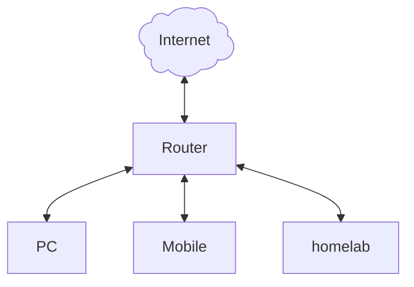
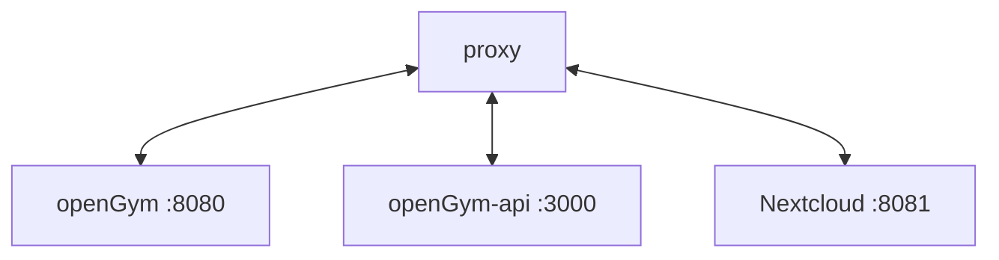

# خودمیزبانی با پروتکل HTTPS

این موضوع به تنهایی یک مبحث نسبتاً پیچیده است، بنابراین جدا از [راهنمای خودمیزبانی (SELF_HOSTING.fa.md)](./SELF_HOSTING.fa.md) که بر نحوه راه‌اندازی و اجرای openGym تمرکز دارد، قرار گرفته است.  
این سند رویکردی عمومی‌تر در مورد نحوه دستیابی به «HTTPS در شبکه خانگی» اتخاذ می‌کند؛ لزوماً منحصر به openGym نیست و برای خودمیزبانی (Self-hosting) به طور کلی کاربرد دارد.

در خودمیزبانی، اغلب این تصور وجود دارد که فرد باید سرویس‌های خود را در اینترنت عمومی باز (Expose) کند، اما این موضوع لزوماً درست نیست.  
ما می‌توانیم بدون نیاز به باز کردن هاست‌های باارزش خود به روی اینترنت، گواهی‌های معتبر HTTPS داشته باشیم. اگر بخواهید بدون VPN از اینترنت به برنامه‌های خود دسترسی پیدا کنید هنوز هم می‌توانید این کار را انجام دهید، اما نیازی به پذیرش این ریسک نیست.

از آنجا که راه‌اندازی VPN خود داستان دیگری دارد، فعلاً فقط روی گواهی‌های امنیتی تمرکز کرده و ترافیک HTTPS را برای میزبان‌های شبکه محلی خود فراهم می‌کنیم.

این راهنما فرض می‌کند که شما از یک هاست لینوکسی (Linux) استفاده می‌کنید و سایر سیستم‌عامل‌ها را پوشش نمی‌دهد.

## اجزا و مؤلفه‌ها

فرض کنید ستاپ زیر را داریم:
- یک سرور کوچک (مثلاً Raspberry Pi یا یک مینی پی‌سی) که برنامه‌های ما را اجرا می‌کند.
- یک کلاینت (کامپیوتر شما، گوشی همراه، تبلت و غیره).
- روتر شما (دستگاهی که دسترسی به اینترنت، وای‌فای و غیره را فراهم می‌کند).



### سامانه نام دامنه (DNS)

در اکثر مواقع، روتر همچنین وظیفه DNS را برای شبکه محلی بر عهده دارد و تمام درخواست‌ها را به DNS ارائه‌دهنده اینترنت هدایت می‌کند.  
(اگر سرور DNS اختصاصی خود را در هوم‌لب راه‌اندازی کرده‌اید، احتمالاً خودتان دقیقاً می‌دانید چه کار می‌کنید.)

کلاینت‌ها (کامپیوتر، تلفن همراه، ...) برای ترجمه آدرس از DNS محلی سؤال می‌کنند و اگر DNS محلی نتواند آدرس مقصد را ارائه دهد، درخواست را به جلو هدایت می‌کند.  
معمولاً سرورهای DNS عمومی نام‌های دامنه را به آدرس‌های IP عمومی ترجمه می‌کنند.  
از آنجایی که ما سرور DNS عمومی اختصاصی نداریم، به یک ارائه‌دهنده DNS (مانند dyndns، duckdns و موارد مشابه) نیاز داریم تا این کار را برای ما انجام دهد: ارائه یک DNS عمومی.

برای اینکه سرورهای DNS عمومی بتوانند آدرس IP محلی هوم‌لب ما را برگردانند، ارائه‌دهنده DNS را تنظیم می‌کنیم.  
اکیداً توصیه می‌شود بررسی کنید که ابزارهای انتخابی شما از چه ارائه‌دهندگان DNS پشتیبانی می‌کنند (در ادامه به این موضوع می‌پردازیم).

### Let's Encrypt!

استفاده از Let's Encrypt رایگان است؛ آن‌ها گواهی‌های امنیتی را برای همه ارائه می‌دهند تا اینترنت امن‌تر شود. برای اطلاعات بیشتر [اینجا](https://letsencrypt.org/docs/why-all-https/) را مطالعه کنید.  
آن‌ها ابزارهایی را برای ایجاد خودکار گواهی‌ها با یک چالش (Challenge) فراهم می‌کنند تا از معتبر بودن درخواست شما اطمینان حاصل شود.  
بنابراین، این ابزار باید به ارائه‌دهنده DNS دسترسی داشته باشد تا رکوردهای TXT موقتی در ورودی DNS ثبت کند.  
اگر همه چیز تأیید شد، مرجع صدور گواهی Let's Encrypt گواهی را امضا کرده و قابل استفاده خواهد بود.

ما از یک گواهی وایلدکارد (Wildcard certificate) استفاده خواهیم کرد تا بتوانیم تمام سرویس‌های خود را با یک گواهی واحد پوشش دهیم.

### پروکسی معکوس (Reverse Proxy)

پروکسی اختیاری اما بسیار مطلوب است. این ابزار به عنوان نوعی دروازه برای سرویس ما عمل می‌کند و می‌تواند یک نقطه ورود واحد به چندین سرویس در هوم‌لب ما باشد.  
فرض کنید سه سرویس در حال اجرا داریم. از آنجا که یک پورت TCP تنها یک بار روی یک هاست قابل استفاده است، ما باید سه پورت مختلف برای دسترسی به سرویس‌های جداگانه خود داشته باشیم.  
به خاطر سپردن تمام این پورت‌ها هنگام استفاده از سرویس‌ها کار خوشایندی نخواهد بود، بنابراین این کار را به پروکسی واگذار می‌کنیم.

پورت 443 (HTTPS) تنها یک بار می‌تواند استفاده شود، بنابراین اجازه می‌دهیم پروکسی ما به آن پورت پاسخ دهد.  
ما پروکسی را به گونه‌ای پیکربندی می‌کنیم که درخواست‌ها را مانند زیر به سرویس‌های مجزای ما ارسال کند:



اکنون یک URL تمیز و مرتب داریم و می‌توانیم پورت‌ها را فراموش کنیم. پروکسی درخواست URL را می‌خواند و آن را به سرویس/هاست مقصد هدایت می‌کند.

## چگونه؟!

بنابراین چگونه همه این‌ها در کنار هم کار می‌کنند؟

1. ارائه‌دهنده DNS نام دامنه را به IP محلی هوم‌لب ترجمه می‌کند (به عنوان مثال: `https://opengym.myhomelab.dedyn.io -> http://192.168.0.100:8080`)
2. پروکسی به IP محلی گوش می‌دهد و ارتباط HTTPS را فراهم می‌کند
3. Let's Encrypt گواهی‌ها را از طریق ابزار certbot تولید و ارائه می‌دهد

### ابزارها

- ارائه‌دهنده DNS: سرویس https://desec.io/ که رایگان است و از IPv6 و پلاگین certbot پشتیبانی می‌کند.
- کلاینت Let's Encrypt: ابزار certbot که رسماً توسط Let's Encrypt پشتیبانی می‌شود.
- پروکسی معکوس (Reverse Proxy): وب‌سرور caddy که سبک، سریع و قابل انعطاف است.

این‌ها ابزارهایی هستند که برای این راهنما انتخاب شده و کارکرد آن‌ها تأیید شده است؛ انتخاب شما ممکن است متفاوت باشد و راه‌اندازی متفاوتی داشته باشد.  
اما مراحل اصلی یکسان است، بنابراین می‌توانید آن را با انتخاب خود تطبیق دهید.

اطلاعات تکمیلی:
- هاست هوم‌لب: `192.168.0.100`  
  سرویس‌های در حال اجرا:  
    - opengym روی پورت `8080`
    - nextcloud روی پورت `8081`

1. در desec.io ثبت‌نام کنید و یک نام انتخاب کنید (ما به عنوان مثال `myhomelab` را در نظر می‌گیریم)
    1. یک رکورد A جدید ایجاد کنید که به سرویس شما اشاره کند، مانند: `*.myhomelab.dedyn.io` (به‌صورت وایلدکارد!) اشاره‌کننده به `192.168.0.100` (آی‌پی هوم‌لب / مینی پی‌سی / Raspberry Pi که پروکسی را اجرا می‌کند).
    2. یک گواهی وایلدکارد تمام ساب‌دامنه‌های آن هاست را پوشش می‌دهد؛ مثلاً `opengym.myhomelab.dedyn.io` و `nextcloud.myhomelab.dedyn.io` می‌توانند از یک گواهی مشترک استفاده کنند.
    3. یک توکن API برای پلاگین certbot بسازید. این توکن فقط باید رکوردهای داخل دامنه شما را بنویسد — گزینه‌های `Can create domains` و `Can delete domains` را **خاموش** بگذارید؛ نشت احتمالی یک توکن نباید بتواند دامنه شما را حذف یا دستکاری کلی کند. توکن را یادداشت کنید زیرا فقط یک بار نمایش داده می‌شود.
2. نرم‌افزار certbot را روی هاست خود نصب کنید
    1. اکثر توزیع‌های لینوکس پکیج‌های آن را ارائه می‌دهند، مثلاً در دبیان/اوبونتو: `apt install certbot python3-certbot-dns-desec`؛ [مستندات](https://desec.readthedocs.io/en/latest/integrations/lets-encrypt.html) را بررسی کنید.
    2. یک فایل کانفیگ در `/etc/letsencrypt` بسازید: `desec.ini` حاوی خط `dns_desec_token = YOUR_TOKEN`، و سطح دسترسی آن را با `chmod 600` محدود کنید.
    3. دستور certbot را برای دریافت گواهی اجرا کنید:
        ```bash
        certbot certonly \
            --authenticator dns-desec \
            --dns-desec-credentials /etc/letsencrypt/desec.ini \
            -m YOUR_EMAIL@HOST.TLD \
            --agree-tos \
            --no-eff-email \
             -d "*.myhomelab.dedyn.io"
        ```
    4. نرم‌افزار certbot همچنین یک سیستم تایمر systemd نصب می‌کند که گواهی را به صورت خودکار تمدید می‌کند. Caddy فایل‌ها را فقط در صورت درخواست مجدداً می‌خواند، بنابراین یک هوک بازنشانی (deploy hook) اضافه کنید: `certbot renew --deploy-hook "systemctl reload caddy"` (یا این خط را در فایل `/etc/letsencrypt/renewal-hooks/deploy/` قرار دهید).
    5. ابزار certbot فایل `privkey.pem` را طوری می‌نویسد که فقط ریشه (root) به آن دسترسی دارد، در حالی که caddy تحت کاربر اختصاصی خود اجرا می‌شود. یا با دستور `chgrp caddy /etc/letsencrypt/live /etc/letsencrypt/archive && chmod g+rx` به کاربر caddy دسترسی بدهید (و `g+r` روی کلید)، یا در داخل deploy hook فایل‌ها را کپی کنید — در غیر این صورت caddy راه‌اندازی می‌شود اما هندشیک TLS با شکست مواجه می‌گردد.
3. وب‌سرور caddy را نصب کنید
    1. اکثر توزیع‌های لینوکس بسته‌های آن را ارائه می‌دهند، مثلاً دبیان: `apt install caddy`؛ [مستندات نصب](https://caddyserver.com/docs/install) را بررسی کنید.
    2. فایل پیکربندی caddy را بسازید، این یک نمونه است که کار می‌کند:
    ```jsonc
    :443 {
        header Content-Type text/html
        respond <<HTML
                <html>
                        <head><title>caddy</title></head>
                        <body><h2>caddy works.</h2></body>
                </html>
                HTML 200
    }
    # تعریف پیکربندی desec
    (desec) {
        tls /etc/letsencrypt/live/myhomelab.dedyn.io/fullchain.pem /etc/letsencrypt/live/myhomelab.dedyn.io/privkey.pem {
                protocols tls1.3
        }
    }
    # کانفیگ پروکسی معکوس برای opengym
    opengym.myhomelab.dedyn.io {
        import desec
        reverse_proxy http://192.168.0.100:8080
    }
    # کانفیگ برای یک سرویس دیگر
    nextcloud.myhomelab.dedyn.io {
        import desec
        reverse_proxy http://192.168.0.100:8081
    }
    ```

همین! اکنون باید بتوانید از شبکه محلی خود از طریق HTTPS و با قابلیت کامل کارکرد کلیدهای عبور (Passkeys) به نسخه opengym خود دسترسی داشته باشید.  
حتماً پیکربندی openGym را مطابق با آن به‌روزرسانی کنید (`RP_ID=opengym.myhomelab.dedyn.io` و `ORIGIN=https://opengym.myhomelab.dedyn.io` — به [SELF_HOSTING.fa.md#۲-درک-الزام-کلید-عبور-passkey-مهم](./SELF_HOSTING.fa.md#2-understand-the-passkey-requirement-important) مراجعه کنید).

**اگر نام دامنه روی گوشی تلفن شما برطرف (Resolve) نمی‌شود:** بسیاری از روترهای خانگی (مانند Fritz!Box یا برخی مودم‌های ISPها) قابلیتی به نام *حفاظت از بازپیوند DNS (DNS rebind protection)* دارند و نام‌های عمومی که به یک IP خصوصی ترجمه می‌شوند را نادیده می‌گیرند. دامنه `myhomelab.dedyn.io` را به لیست استثناهای rebind در روتر خود اضافه کنید، یا از یک سرور DNS محلی اختصاصی استفاده نمایید.

آدرس‌های اینترنتی قابل استفاده در این مثال:
- `https://opengym.myhomelab.dedyn.io -> http://192.168.0.100:8080`
- `https://nextcloud.myhomelab.dedyn.io -> http://192.168.0.100:8081`

توجه داشته باشید که خاتمه SSL/HTTPS فقط در پروکسی انجام می‌شود و خود سرویس داخلی هیچ گواهینامه‌ای ندارد.

### گزینه‌های جایگزین

- ارائه‌دهندگان DNS: [فهرست ارائه‌دهندگان certbot](https://certbot.eff.org/hosting_providers) (گزینه‌های بسیار متنوعی در دسترس است...)
- کلاینت‌های Let's Encrypt: [اینجا را ببینید](https://letsencrypt.org/docs/client-options/)
- پروکسی معکوس (Reverse proxy): ابزار Nginx Proxy Manager با رابط کاربری وب آسان‌تر

## جمع‌بندی

ما با استفاده از Let's Encrypt، certbot و caddy یک دسترسی کاملاً متکی بر شبکه محلی با پروتکل امن HTTPS برای سرویس‌های خود ایجاد کردیم.  
در صورت بروز هرگونه مشکل، لطفاً مستندات مربوطه را بررسی کنید:
- [desec](https://desec.readthedocs.io/en/latest/index.html) 
- [caddy](https://caddyserver.com/docs/) 
- [Let's encrypt](https://letsencrypt.org/docs/) 
- [certbot](https://certbot.eff.org/) 

دسترسی به سرویس‌ها از خارج از شبکه محلی شما (مانند استفاده از WireGuard به همراه یک به‌روزرسان dynamic-DNS) خارج از حیطه این راهنما است.
